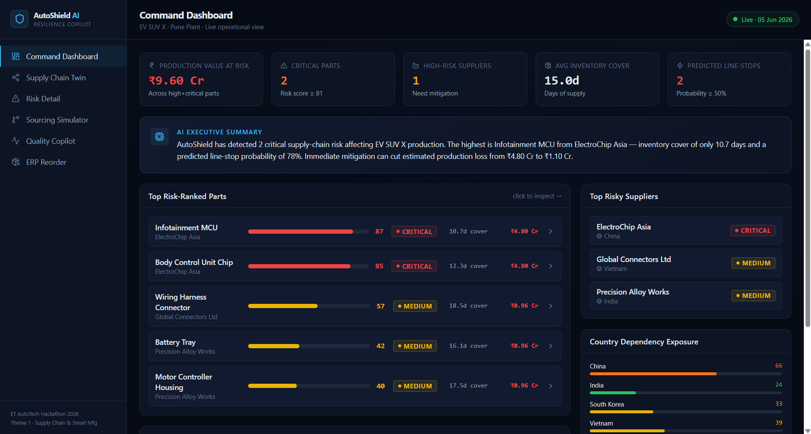
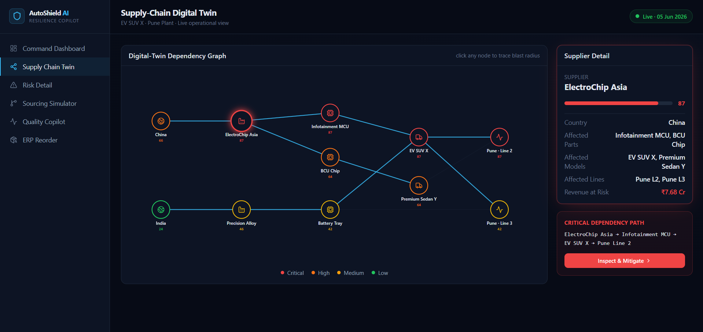
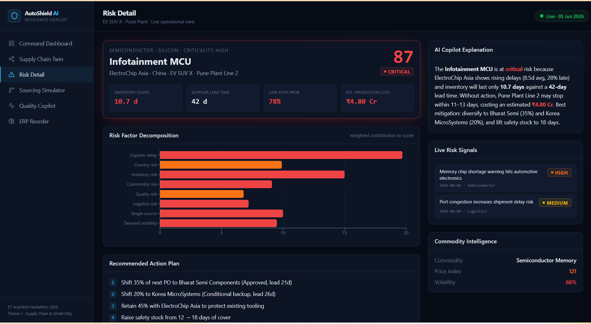
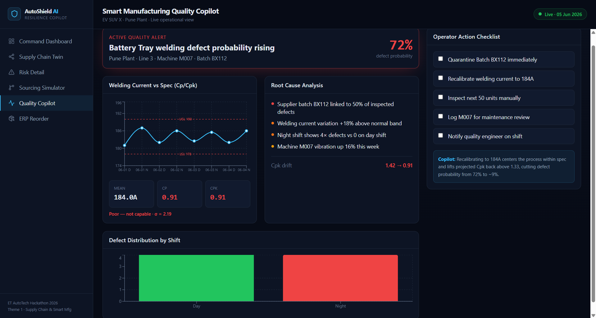
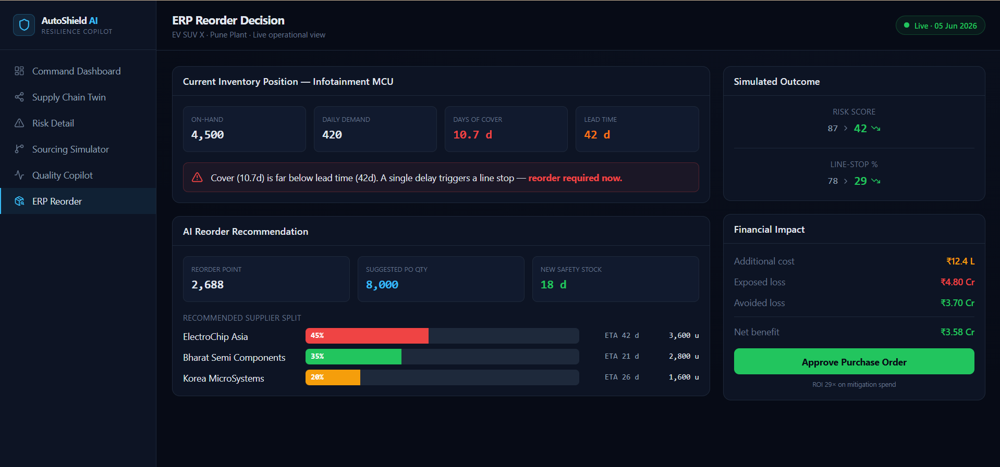

# AutoShield AI

**AI-Powered Supply Chain Resilience & Smart Manufacturing Copilot for Automotive OEMs**

Built for ET Auto Hackathon 2026 — Theme 1: AI for Resilient Automotive Supply Chains & Smart Manufacturing

---

## Overview

AutoShield AI is a full-stack decision-support platform that helps automotive OEMs, EV manufacturers, and Tier-1 suppliers predict and prevent supply chain disruptions before they stop production lines.

It combines a multi-factor risk scoring engine with GPT-4o intelligence to turn raw supplier, inventory, commodity, and manufacturing data into specific, quantified actions — not just dashboards.

---

## Screenshots

### Dashboard


### Supply Chain Digital Twin


### Risk Detail


### Quality Copilot


### ERP Reorder Simulator


---

## Features

### Risk Intelligence Engine
Scores every part (0–100) across eight weighted factors:

| Factor | What it measures |
|---|---|
| Supplier delay | On-time delivery rate + avg delay days |
| Country risk | Geopolitical, trade restriction, currency, logistics |
| Inventory | Days of cover vs supplier lead time |
| Commodity | Price index volatility of the part's raw material |
| Quality | Supplier defect rate |
| Logistics | Route-level disruption signals |
| Single source | Concentration penalty for sole-sourced parts |
| Demand volatility | Demand variability of the part |

Outputs per part: risk score, risk level, inventory days, line-stop probability, and estimated production loss in INR.

### Supply Chain Digital Twin
Interactive graph of the full supplier → part → vehicle model → plant relationship network. Nodes are color-coded by risk score (red / orange / yellow / green) so bottlenecks are visible at a glance.

### Alternate Sourcing Engine
For any high-risk part, ranks qualified and conditional alternate suppliers by a composite score (quality, delivery, cost, lead time, sustainability). Proposes an optimized multi-source split and simulates post-mitigation risk.

### ERP Reorder Simulator
Calculates reorder point, suggested purchase quantity, and expected supplier split. Compares before/after risk score and line-stop probability, and estimates avoided production loss in INR.

### Smart Manufacturing Quality Copilot
Monitors production telemetry (welding current, temperature, pressure, torque, cycle time) and computes Cp/Cpk per machine and shift. Surfaces defect-linked batches, machine anomalies, and shift-level drift with root-cause breakdowns.

### GPT-4o AI Layer
Seven AI-powered endpoints, all grounded in live data:

| Endpoint | What it does |
|---|---|
| `GET /api/ai/executive-briefing` | C-suite 3-paragraph risk briefing with financial exposure |
| `POST /api/ai/deep-analysis/{part_id}` | Structured deep dive: root causes, timeline, mitigation playbook |
| `POST /api/ai/chat` | Streaming SSE copilot chat with full supply chain context |
| `GET /api/ai/quality-rca` | Expert root-cause analysis for active manufacturing anomalies |
| `POST /api/ai/scenario` | What-if scenario planner (China ban, Taiwan crisis, supplier failure, etc.) |
| `GET /api/ai/news-intel` | Structured risk intelligence extracted from live news signals |
| `POST /api/ai/procurement-strategy/{part_id}` | 90-day procurement playbook with week-by-week actions |

---

## Tech Stack

| Layer | Technology |
|---|---|
| Frontend | React 19, Vite, Tailwind CSS v4, Recharts, Lucide React |
| Backend | FastAPI, Python, Uvicorn |
| AI | OpenAI GPT-4o via `openai` SDK |
| Data | CSV datasets (suppliers, parts, shipments, production, commodities, news) |

---

## Project Structure

```
autoshield-ai/
├── backend/
│   ├── main.py               # FastAPI app + all route handlers
│   ├── requirements.txt
│   ├── .env                  # OPENAI_API_KEY (not committed)
│   ├── app/
│   │   ├── ai_service.py     # GPT-4o intelligence layer
│   │   ├── services.py       # Risk engine, recommendations, quality, ERP
│   │   ├── scoring.py        # Risk factor math, Cp/Cpk, supplier ranking
│   │   ├── data_loader.py    # CSV loader + in-memory DB
│   │   └── __init__.py
│   └── data/
│       ├── suppliers.csv           (60 suppliers, 12 countries)
│       ├── parts.csv               (60 parts across 5 vehicle models)
│       ├── alternate_suppliers.csv (201 alternate supplier mappings)
│       ├── country_risk.csv        (60 countries, 4 risk dimensions)
│       ├── commodity_prices.csv    (676 weekly price points, 13 commodities)
│       ├── shipments.csv           (300 shipments, Oct 2025–Jun 2026)
│       ├── production_data.csv     (3,240 machine-shift records)
│       └── news_risk_signals.csv   (352 risk news signals)
├── frontend/
│   ├── src/
│   │   ├── App.jsx           # Single-page app with all views
│   │   └── main.jsx
│   ├── index.html
│   ├── package.json
│   └── vite.config.js
├── screenshots/
└── README.md
```

---

## Getting Started

### Prerequisites
- Python 3.10+
- Node.js 18+
- An OpenAI API key with GPT-4o access

### Backend

```bash
cd backend
python -m venv venv

# Windows
.\venv\Scripts\activate

# macOS / Linux
source venv/bin/activate

pip install -r requirements.txt
```

Add your OpenAI key to `backend/.env`:

```
OPENAI_API_KEY=sk-...
```

Start the server:

```bash
# Windows (using venv directly)
.\venv\Scripts\uvicorn.exe main:app --reload --port 8000

# macOS / Linux
uvicorn main:app --reload --port 8000
```

API available at `http://localhost:8000`  
Swagger docs at `http://localhost:8000/docs`

### Frontend

```bash
cd frontend
npm install
npm run dev
```

App available at `http://localhost:5173`

---

## API Reference

```
GET  /api/dashboard                          # Risk summary + top 5 parts
GET  /api/risks                              # All parts sorted by risk score
GET  /api/risks/{part_id}                    # Full risk detail for one part
GET  /api/recommendations/{part_id}          # Alternate supplier ranking + split
POST /api/simulate-supplier-split            # Post-mitigation risk simulation
GET  /api/supply-chain-graph                 # Graph nodes + edges for digital twin
GET  /api/quality/alerts                     # Active manufacturing quality alerts
GET  /api/quality/cpk/{part_id}              # Cp/Cpk stats for a part
POST /api/erp/reorder                        # ERP reorder simulation

GET  /api/ai/executive-briefing              # GPT-4o C-suite briefing
POST /api/ai/deep-analysis/{part_id}         # GPT-4o structured risk deep dive
POST /api/ai/chat                            # Streaming GPT-4o copilot chat (SSE)
GET  /api/ai/quality-rca                     # GPT-4o manufacturing root-cause analysis
POST /api/ai/scenario                        # GPT-4o what-if scenario planner
GET  /api/ai/news-intel                      # GPT-4o news risk intelligence
POST /api/ai/procurement-strategy/{part_id}  # GPT-4o 90-day procurement playbook
```

---

## Demo Scenario

**Input:** Infotainment MCU (P001) — ElectroChip Asia, China  
- Risk score: 87 (Critical)  
- Inventory cover: 10.7 days vs 42-day lead time  
- Line-stop probability: 78%  

**AI Recommendation:** Shift 35% to Bharat Semi Components + 20% to Korea MicroSystems, raise safety stock to 18 days, place 8,000-unit PO immediately.

**Result:**

| Metric | Before | After |
|---|---|---|
| Risk Score | 87 | 42 |
| Line-Stop Probability | 78% | 29% |
| Production Loss Risk | ₹4.8 Cr | ₹1.1 Cr |

---

## Hackathon Alignment

ET Auto Hackathon 2026 — Theme 1: **AI for Resilient Automotive Supply Chains & Smart Manufacturing**

- Supply chain risk prediction and prevention
- AI-driven alternate sourcing and supplier diversification
- Inventory optimization with quantified financial impact
- Smart manufacturing quality monitoring (Cp/Cpk, shift analysis)
- GPT-4o decision intelligence grounded in live operational data

---

*AutoShield AI — Predict · Prevent · Protect*
